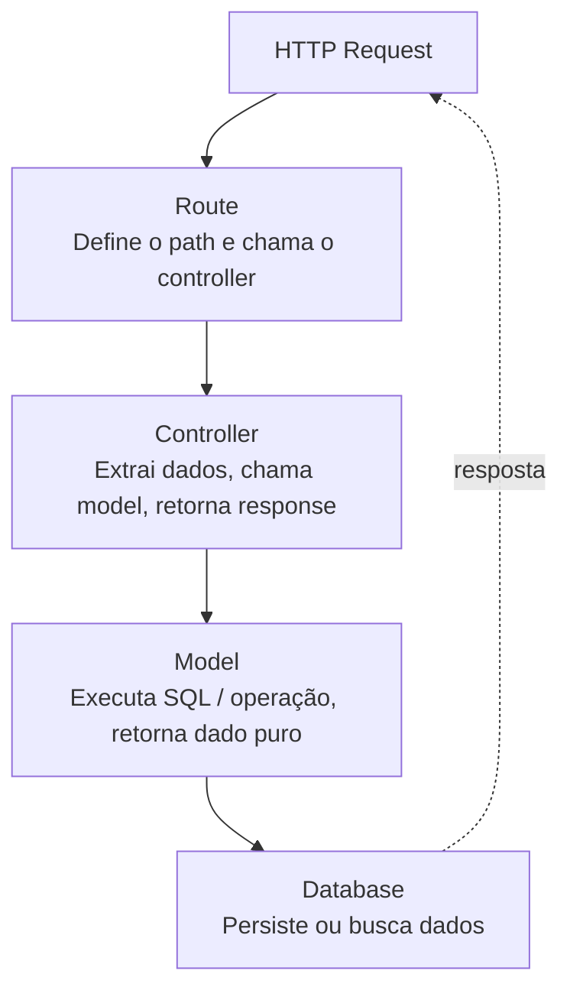

# Diretrizes de Arquitetura MVC Alvo

## Princípio Fundamental
**Model-View-Controller** separa a aplicação em três camadas com responsabilidades exclusivas:
- **Model**: Acesso a dados e regras de domínio
- **View/Routes**: Definição de endpoints e roteamento HTTP
- **Controller**: Orquestração do fluxo (recebe request → chama model → retorna response)

A separação correta garante: testabilidade, manutenibilidade e escalabilidade.

---

## Regras por Camada

### MODEL (src/models/)
**Responsabilidades:**
- ✅ Executar queries SQL / operações no banco
- ✅ Mapear resultados do banco para dicionários/objetos
- ✅ Validações de domínio (ex: CPF válido, email com @)
- ✅ Cálculos intrínsecos à entidade (ex: calcular total de um pedido)

**Proibições:**
- ❌ Nunca importar `flask`, `request`, `jsonify`
- ❌ Nunca retornar Response HTTP
- ❌ Nunca conhecer a existência de rotas

**Nomenclatura:**
- Python: `produto_model.py` — função `criar_produto()`, `buscar_produto_por_id()`
- Node.js: `ProductModel.js` — método `create()`, `findById()`

### CONTROLLER (src/controllers/)
**Responsabilidades:**
- ✅ Extrair e validar dados da request (`request.json`, `request.args`)
- ✅ Chamar os métodos do Model apropriados
- ✅ Construir e retornar a resposta HTTP (`jsonify`, `res.json`)
- ✅ Tratar erros com try/except e retornar status codes corretos

**Proibições:**
- ❌ Nunca executar SQL diretamente
- ❌ Nunca ter lógica de negócio complexa (loops de cálculo, regras de domínio)
- ❌ Nunca conhecer detalhes de implementação do banco

**Nomenclatura:**
- Python: `produto_controller.py` — função `get_produto()`, `create_produto()`
- Node.js: `ProductController.js` — método `getProduct()`, `createProduct()`

### VIEW / ROUTES (src/views/ ou src/routes/)
**Responsabilidades:**
- ✅ Registrar endpoints HTTP (path + método)
- ✅ Associar cada endpoint ao controller correto
- ✅ Aplicar middlewares de autenticação por rota

**Proibições:**
- ❌ Nenhuma lógica de negócio
- ❌ Nenhum acesso a banco de dados
- ❌ Nenhum processamento de dados (apenas roteamento)

**Nomenclatura:**
- Python: `routes.py` ou `produto_routes.py`
- Node.js: `productRoutes.js`

### CONFIG (src/config/)
**Responsabilidades:**
- ✅ Ler variáveis de ambiente
- ✅ Definir configurações por ambiente (dev/staging/prod)
- ✅ Exportar objetos de configuração tipados

**Proibições:**
- ❌ Nunca ter valores hardcoded de credenciais
- ❌ Nunca conter lógica de negócio

---

## Estrutura de Diretórios Padrão

### Python / Flask:
```
src/
├── config/
│   └── settings.py        # Lê .env, define DATABASE_URL, SECRET_KEY
├── models/
│   ├── __init__.py
│   ├── database.py        # Conexão e utilitários de DB
│   ├── produto_model.py
│   ├── usuario_model.py
│   └── pedido_model.py
├── controllers/
│   ├── __init__.py
│   ├── produto_controller.py
│   ├── usuario_controller.py
│   └── pedido_controller.py
├── views/
│   ├── __init__.py
│   └── routes.py          # Todos os blueprints registrados
├── middlewares/
│   ├── __init__.py
│   └── error_handler.py   # @app.errorhandler global
└── app.py                 # Composition root — cria app, registra tudo
requirements.txt
.env.example
```

### Node.js / Express:

```
src/
├── config/
│   └── settings.js        # Lê process.env, valida variáveis obrigatórias
├── models/
│   ├── database.js        # Pool de conexões, utilitários de query
│   ├── ProductModel.js
│   ├── UserModel.js
│   └── OrderModel.js
├── controllers/
│   ├── ProductController.js
│   ├── UserController.js
│   └── OrderController.js
├── routes/
│   ├── productRoutes.js
│   ├── userRoutes.js
│   └── orderRoutes.js
├── middlewares/
│   └── errorHandler.js    # Express error middleware (err, req, res, next)
└── app.js                 # Composition root
package.json
.env.example
```

---

## Fluxo de uma Request no MVC Correto




---

## Checklist de Validação MVC

Após a refatoração, verifique:

- [ ] Nenhum arquivo de model importa `flask` ou `express`
- [ ] Nenhuma função de rota contém SQL
- [ ] Nenhum controller ultrapassa 40 linhas por função
- [ ] Configurações lidas de variáveis de ambiente (`.env`)
- [ ] Error handling centralizado em middleware
- [ ] Entry point (`app.py`/`app.js`) tem menos de 30 linhas
- [ ] Cada arquivo tem responsabilidade única e identificável